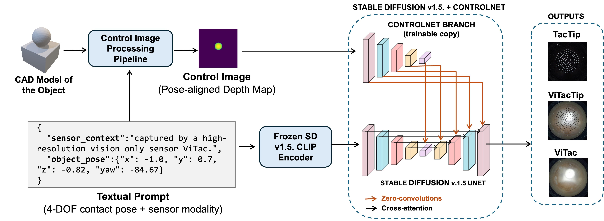

# MultiDiffSense: Diffusion-Based Multi-Modal Visuo-Tactile Image Generation

[](https://arxiv.org/)
[](LICENSE)
[](https://www.python.org/)
[](https://pytorch.org/)

Official implementation of **MultiDiffSense**, a ControlNet-based diffusion model for generating multi-modal visuo-tactile sensor images using text and depth map conditioning. This work addresses the cross-modal translation problem in tactile sensing by generating realistic aligned sensor outputs across 3 sensor madalities (TacTip, ViTac, ViTacTip) using depth maps- and text-guided diffusion.

<p align="center">
  
</p>

---

## Table of Contents

- [Overview](#overview)
- [Repository Structure](#repository-structure)
- [Installation](#installation)
- [Dataset Preparation](#dataset-preparation)
- [Training](#training)
- [Testing & Evaluation](#testing--evaluation)
- [Ablation Studies](#ablation-studies)
- [Baseline Comparison (cGAN / Pix2Pix)](#baseline-comparison-cgan--pix2pix)
- [Inference / Generation](#inference--generation)
- [Example Data](#example-data)
- [Citation](#citation)
- [Acknowledgements](#acknowledgements)

---

## Overview

MultiDiffSense leverages ControlNet (built on Stable Diffusion 1.5) to translate depth map renderings of 3D objects into realistic tactile sensor images across three sensor modalities:

- **TacTip** — Optical tactile sensor with pin-based deformation markers
- **ViTac** — Vision-based tactile sensor
- **ViTacTip** — Hybrid vision-tactile sensor

The model is conditioned on:
1. **Depth maps** (rendered from STL files) as spatial control signals
2. **Text prompts** describing the object geometry, contact conditions, and target sensor type

---

## Repository Structure

```
MultiDiffSense/
├── configs/                          # Configuration files
│   ├── controlnet_train.yaml         # Training config (paths, hyperparams)
│   └── cldm_v15.yaml                # ControlNet + SD1.5 architecture config
│
├── multidiffsense/                   # Core source code
│   ├── controlnet/                   # ControlNet model code
│   │   ├── cldm/                     # ControlNet modules
│   │   │   ├── cldm.py              # ControlledUNet, ControlNet, ControlLDM
│   │   │   ├── ddim_hacked.py       # DDIM sampler for ControlNet
│   │   │   ├── hack.py              # CLIP and attention hacks
│   │   │   ├── logger.py            # Image logging callback
│   │   │   ├── loss_plotter.py      # Training loss visualisation callback
│   │   │   └── model.py             # Model creation and checkpoint loading
│   │   ├── train.py                 # ControlNet training script
│   │   ├── test.py                  # Testing with quantitative metrics
│   │   ├── generate.py              # Inference-only generation
│   │   └── data_loader.py           # Dataset class for ControlNet
│   │
│   ├── baseline_cgan/               # Pix2Pix (cGAN) baseline
│   │   ├── train.py                 # cGAN training (wraps pytorch-CycleGAN-and-pix2pix)
│   │   ├── test.py                  # cGAN testing with same metrics
│   │   ├── dataset_converter.py     # Convert ControlNet format → Pix2Pix format
│   │   └── README.md                # Baseline-specific setup instructions
│   │
│   ├── data_preparation/            # Dataset building pipeline
│   │   ├── source_processing.py     # Render depth maps from STL via pyrender + pose alignment
│   │   ├── target_processing.py     # Rename + resize tactile sensor images
│   │   ├── prompt_creation.py       # Generate prompt.json from CSV pose data
│   │   ├── ds_creation.py           # Assemble mega dataset (merge per-object datasets)
│   │   ├── dataset_split.py         # Train/val/test splitting (70/15/15)
│   │   ├── modality_split.py        # Split prompts by sensor modality for evaluation
│   │   └── all_processing.py        # Orchestrator: run full pipeline per object
│   │
│   └── evaluation/                  # Evaluation utilities
│       └── metrics.py               # SSIM, PSNR, MSE, LPIPS, FID computation
│
├── scripts/                          # Shell scripts for common workflows
│   ├── prepare_model.sh             # Download SD1.5 + create ControlNet init checkpoint
│   ├── train_controlnet.sh          # Launch ControlNet training
│   ├── test_controlnet.sh           # Launch ControlNet testing
│   ├── train_pix2pix.sh             # Launch Pix2Pix baseline training
│   └── test_pix2pix.sh             # Launch Pix2Pix baseline testing
│
├── data/                             # Dataset directory (user-populated)
│   └── example/                     # Minimal example dataset (1 object, 3 sensors)
│       ├── stl/                     # Source STL files: <obj_id>.stl
│       ├── csv/                     # Per-object pose CSV: <obj_id>.csv
│       ├── tactile/                 # Tactile images per object/sensor
│       │   └── <obj_id>/
│       │       ├── TacTip/target/
│       │       ├── ViTac/target/
│       │       └── ViTacTip/target/
│       └── prompt.json              # Example prompt file (JSONL)
│
├── docs/                            # Documentation and figures
│   └── figures/
│
├── tool_add_control.py              # Utility: create ControlNet init weights from SD1.5
├── get_model_size.py                # Utility: count and analyse model parameters
├── requirements.txt                 # Python dependencies
├── environment.yml                  # Conda environment specification
├── LICENSE
└── README.md                        # This file
```

---

## Installation

### Option A: Conda (recommended)

```bash
git clone https://github.com/<your-username>/MultiDiffSense.git
cd MultiDiffSense
conda env create -f environment.yml
conda activate multidiffsense
```

### Option B: pip

```bash
git clone https://github.com/<your-username>/MultiDiffSense.git
cd MultiDiffSense
pip install -r requirements.txt
```

### Pre-trained Weights

Download the Stable Diffusion v1.5 checkpoint and create the ControlNet initialisation weights:

```bash
bash scripts/prepare_model.sh
```

This will:
1. Download `v1-5-pruned.ckpt` from Hugging Face
2. Run `tool_add_control.py` to produce `models/control_sd15_ini.ckpt`

---

## Dataset Preparation

The full pipeline to build the training dataset from raw data.

**Expected directory structure:**
```
data/example/
├── stl/          # STL mesh files: <obj_id>.stl
├── csv/          # Pose CSV files: <obj_id>.csv
└── tactile/      # Tactile images per object/sensor
    └── <obj_id>/
        ├── TacTip/target/
        ├── ViTac/target/
        └── ViTacTip/target/
```

### Step 1: Per-Object Processing (all-in-one)

Process one or more objects end-to-end across all three sensor modalities:

```bash
python -m multidiffsense.data_preparation.all_processing \
    --stl_dir data/example/stl \
    --csv_dir data/example/csv \
    --tactile_dir data/example/tactile \
    --obj_ids 1
```

**Processing order per object:**

| Step | ViTac (1st) | TacTip (2nd) | ViTacTip (3rd) |
|------|-------------|--------------|----------------|
| Target processing | Rename + resize | Rename + resize | Rename + resize |
| Source processing | **Generate from STL** | Copy from ViTac | Copy from ViTac |
| Prompt creation | Generate from CSV | Generate from CSV | Generate from CSV |

**Why ViTac first?** Source (depth map) generation aligns each frame by extracting the object from the tactile image to determine its bounding box and centre position. ViTac images are vision-only with no pin markers on the sensor surface, making the object boundary much clearer and easier to segment than TacTip (pin markers) or ViTacTip (hybrid markers). Since the source depth maps represent the same object at the same pose regardless of sensor, they are generated once from ViTac and copied to the other two modalities.

Under the hood, this runs three sub-steps per sensor:

1. **Target processing** (`target_processing.py`) — renames raw tactile images to `<obj_id>_<sensor>_<frame>.png` and resizes to 512×512.
2. **Source processing** (`source_processing.py`) — renders a base depth map from the STL file via pyrender, then applies per-frame pose transformations (depth-based scaling, yaw rotation, xy translation) and centre-error correction. Only runs for ViTac; source images are copied to TacTip and ViTacTip.
3. **Prompt creation** (`prompt_creation.py`) — reads the per-object CSV (`<csv_dir>/<obj_id>.csv`) and writes a JSONL prompt file encoding sensor context and 4-DOF pose (x, y, z, yaw).

### Step 2: Assemble Mega Dataset

Merge per-object datasets across all three sensor modalities into a single dataset:

```bash
python -m multidiffsense.data_preparation.ds_creation \
    --tactile_dir data/example/tactile \
    --output_dir datasets \
    --object_ids 1 \
    --sensors TacTip ViTac ViTacTip
```

This copies all source/target images into a flat `source/` and `target/` directory and merges all per-object prompt.json files into one.

### Step 3: Train/Val/Test Split

```bash
python -m multidiffsense.data_preparation.dataset_split \
    --base_dir datasets \
    --seed 16
```

Splits the merged prompt.json into `train/`, `val/`, `test/` subdirectories (70/15/15). Groups by source image so all sensor modalities for the same contact stay in the same split.

### Step 4: Per-Modality Split (for evaluation)

```bash
python -m multidiffsense.data_preparation.modality_split \
    --prompt_path datasets/test/prompt.json \
    --output_dir datasets/
```

Creates `prompt_TacTip.json`, `prompt_ViTac.json`, and `prompt_ViTacTip.json` for per-sensor evaluation.

---

## Training

### ControlNet (MultiDiffSense)

```bash
python multidiffsense/controlnet/train.py \
    --config configs/controlnet_train.yaml \
    --batch_size 8 \
    --lr 1e-5 \
    --max_epochs 150 \
    --sd_locked
```

Key training parameters:
| Parameter | Default | Description |
|-----------|---------|-------------|
| `batch_size` | 8 | Training batch size |
| `lr` | 1e-5 | Learning rate |
| `max_epochs` | 150 | Maximum training epochs |
| `sd_locked` | True | Freeze Stable Diffusion backbone |
| `precision` | 32 | Training precision |
| `early_stop_patience` | 10 | Early stopping patience |

Training logs and checkpoints are saved to `results/lightning_logs/`.

---

## Testing & Evaluation

```bash
# Test on seen objects (test split)
python multidiffsense/controlnet/test.py \
    --config configs/controlnet_train.yaml \
    --checkpoint path/to/best_checkpoint.ckpt \
    --modality ViTacTip \
    --seen_objects \
    --output_dir results/test_seen

# Test on unseen objects
python multidiffsense/controlnet/test.py \
    --config configs/controlnet_train.yaml \
    --checkpoint path/to/best_checkpoint.ckpt \
    --modality TacTip \
    --output_dir results/test_unseen
```

Reported metrics (computed per-image and aggregated):
- **SSIM** — Structural Similarity Index
- **PSNR** — Peak Signal-to-Noise Ratio (dB)
- **MSE** — Mean Squared Error
- **LPIPS** — Learned Perceptual Image Patch Similarity (AlexNet)
- **FID** — Fréchet Inception Distance

Results are saved as a CSV file and visual grids (control | target | generated).

---

## Ablation Studies

To reproduce the ablation experiments from the paper:

### 1. No Prompt (text conditioning removed)

```bash
python multidiffsense/controlnet/test.py \
    --checkpoint path/to/checkpoint.ckpt \
    --modality ViTacTip \
    --no_prompt \
    --output_dir results/ablation_no_prompt
```

### 2. No Source (depth map conditioning removed)

```bash
python multidiffsense/controlnet/test.py \
    --checkpoint path/to/checkpoint.ckpt \
    --modality ViTacTip \
    --no_source \
    --output_dir results/ablation_no_source
```

### 3. Per-Modality Evaluation

Run testing separately for each sensor type to get per-modality metrics:

```bash
for modality in TacTip ViTac ViTacTip; do
    python multidiffsense/controlnet/test.py \
        --checkpoint path/to/checkpoint.ckpt \
        --modality $modality \
        --output_dir results/ablation_${modality}
done
```

---

## Baseline Comparison (cGAN / Pix2Pix)

We compare against Pix2Pix as a conditional GAN baseline using the [pytorch-CycleGAN-and-pix2pix](https://github.com/junyanz/pytorch-CycleGAN-and-pix2pix) framework.

### Setup

```bash
# Clone the Pix2Pix framework (required dependency)
git clone https://github.com/junyanz/pytorch-CycleGAN-and-pix2pix external/pytorch-CycleGAN-and-pix2pix
```

### Convert Dataset Format

```bash
python multidiffsense/baseline_cgan/dataset_converter.py \
    --controlnet_dataset data/processed \
    --output_path external/pytorch-CycleGAN-and-pix2pix/datasets/depth_to_sensor \
    --modality TacTip
```

### Train Pix2Pix

```bash
bash scripts/train_pix2pix.sh
# Or:
cd external/pytorch-CycleGAN-and-pix2pix
python train.py \
    --dataroot datasets/depth_to_sensor \
    --name depth_to_sensor_experiment \
    --model pix2pix \
    --direction AtoB \
    --n_epochs 200 \
    --n_epochs_decay 100
```

### Test Pix2Pix

```bash
bash scripts/test_pix2pix.sh
```

The test script computes the same metrics (SSIM, PSNR, MSE, LPIPS, FID) for fair comparison.

---

## Inference / Generation

Generate tactile images from depth maps without ground truth targets:

```bash
python multidiffsense/controlnet/generate.py \
    --config configs/controlnet_train.yaml \
    --checkpoint path/to/best_checkpoint.ckpt \
    --source_dir data/new_objects/depth_maps \
    --prompt_json data/new_objects/prompts.json \
    --modality TacTip \
    --output_dir results/generated
```

---

## Example Data

The `data/example/` directory contains a minimal working example with:
- 1 object across 3 sensor modalities (TacTip, ViTac, ViTacTip)
- Per-object pose CSV in `csv/<obj_id>.csv` (tab-separated, 6-DOF pose + 6-DOF move)
- STL source file in `stl/<obj_id>.stl`
- Tactile images in `tactile/<obj_id>/<sensor_type>/target/`

To verify your installation, run the per-object pipeline on the example data:

```bash
python -m multidiffsense.data_preparation.all_processing \
    --stl_dir data/example/stl \
    --csv_dir data/example/csv \
    --tactile_dir data/example/tactile \
    --obj_ids 1
```

---

## Citation

If you find this work useful, please cite:

```bibtex
@inproceedings{multidiffsense2026,
    title     = {MultiDiffSense: Diffusion-Based Multi-Modal Visuo-Tactile Image Generation},
    author    = {TODO},
    booktitle = {IEEE International Conference on Robotics and Automation (ICRA)},
    year      = {2026}
}
```

---

## Acknowledgements

- [ControlNet](https://github.com/lllyasviel/ControlNet) by Lvmin Zhang et al.
- [Stable Diffusion](https://github.com/CompVis/stable-diffusion) by Rombach et al.
- [pytorch-CycleGAN-and-pix2pix](https://github.com/junyanz/pytorch-CycleGAN-and-pix2pix) by Zhu et al.

---

## License

This project is licensed under the MIT License — see [LICENSE](LICENSE) for details.
